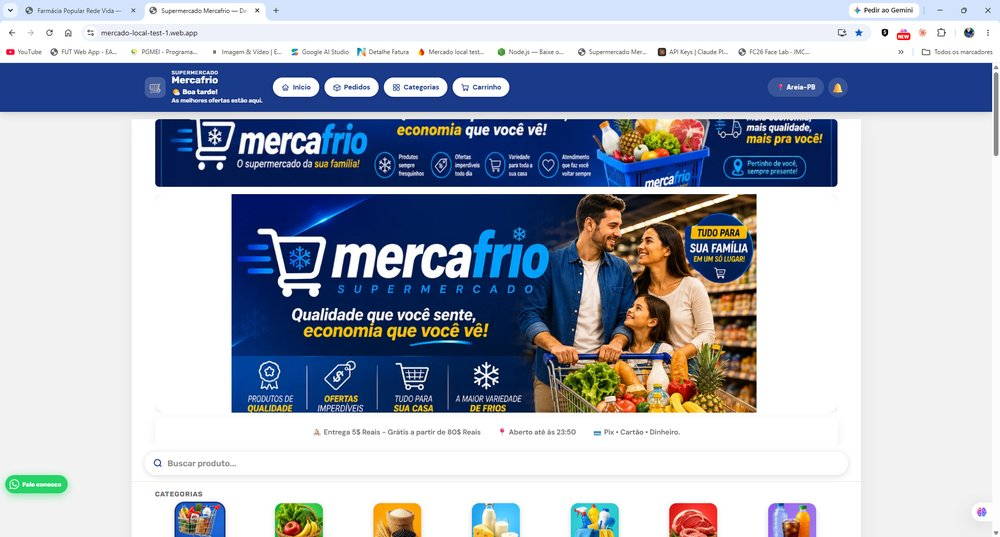

# 💊 Farmácia Popular Rede Vida — Plataforma de Delivery para Farmácia

Site de pedidos online para a **Farmácia Popular Rede Vida**, adaptado do sistema de delivery Mercafrio para as necessidades específicas do varejo farmacêutico.

**🔗 Demo ao vivo:** https://nexo-commerce---farmacia.web.app

## 💡 Motivação

Assim como no varejo alimentício, muitas farmácias de bairro ainda atendem pedidos manualmente pelo WhatsApp. No caso de farmácias, isso é ainda mais delicado: é preciso lidar com receita médica, medicamento controlado e dúvidas sobre dosagem — tudo isso sendo resolvido "de cabeça" no chat. Essa plataforma organiza esse fluxo em uma loja online própria, mantendo o WhatsApp apenas para a etapa final de confirmação e envio de receita.

## ✨ Funcionalidades

- Catálogo de produtos com informações de laboratório e dosagem
- Busca por necessidade (ex: "dor de cabeça", "gripe") além da busca tradicional
- Fluxo dedicado para produtos que exigem receita médica ou são medicamentos controlados
- Categorias específicas do segmento farmacêutico
- Seção de ofertas em destaque
- Carrinho de compras e finalização de pedido via WhatsApp
- Acompanhamento de pedido pelo cliente
- Aplicativo instalável (PWA), layout responsivo (mobile e desktop)

### Painel administrativo

- Autenticação de administrador (Firebase Auth)
- Controle de estoque em tempo real, com baixa e estorno automático por transação
- Gestão de banners, categorias, produtos e promoções
- Identidade visual configurável (cores, logo)

## 🛠️ Tecnologias

- JavaScript, HTML5, CSS3 (vanilla, sem framework)
- Firebase Firestore (banco de dados em tempo real)
- Firebase Authentication (login do admin)
- PWA (manifest + service worker)

## 🔒 Segurança

Segredos (senha de admin, chaves de API) nunca ficam no código-fonte: são carregados em tempo de execução a partir de uma coleção protegida do Firestore, acessível apenas por administradores autenticados (ver `firestore.rules`).

---

Projeto desenvolvido por [John Michael](https://github.com/JohnMichaeldev). Baseado na mesma plataforma do [Mercafrio](https://github.com/JohnMichaeldev/mercafrio-supermercado), adaptada para o segmento farmacêutico.
